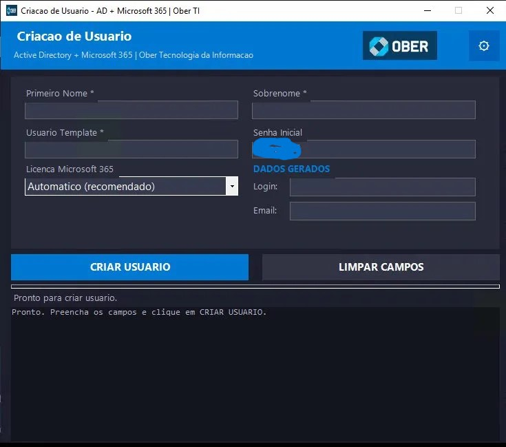

# 👤 AD User Creator — Active Directory + Microsoft 365

Ferramenta PowerShell para criação automatizada de usuários no **Active Directory** integrada com o **Microsoft 365**, com interface gráfica moderna e atribuição automática de licenças via Microsoft Graph API.


---

## ✨ Funcionalidades

- **Interface gráfica** moderna (WinForms) com tema escuro
- **Modo CLI** via `.bat` para uso em terminal
- Criação do usuário no AD copiando **OU, grupos, departamento, cargo e gestor** de um usuário template
- **Sincronização automática** com Azure AD via `ADSync` (Delta Sync)
- Atribuição automática de licenças Microsoft 365 via **Graph API**:
  - Microsoft 365 Business Standard (SPB)
  - M365 Apps Enterprise + Exchange Online Plan 1
  - Modo automático (detecta a licença disponível)
- **Log colorido** em tempo real na interface
- **Histórico em CSV** de todos os usuários criados
- Credenciais Graph API salvas com **criptografia DPAPI** (por usuário/máquina)

---

## 📋 Pré-requisitos

| Requisito | Descrição |
|-----------|-----------|
| Windows Server 2016+ ou Windows 10/11 | com RSAT instalado |
| PowerShell 5.1+ | já incluso no Windows |
| Módulo `ActiveDirectory` | parte do RSAT |
| Azure App Registration | com permissões Graph API |
| (Opcional) Azure AD Connect | para sincronização automática |

### Permissões necessárias na App Registration (Graph API)

```
User.ReadWrite.All
Directory.ReadWrite.All
Organization.Read.All
```

---

## 🚀 Instalação

### 1. Clone o repositório

```powershell
git clone https://github.com/seu-usuario/ad-user-creator.git
cd ad-user-creator
```

### 2. Configure o arquivo de ambiente

```powershell
Copy-Item config.example.ps1 config.ps1
notepad config.ps1
```

Edite o `config.ps1` com os dados da sua organização:

```powershell
$TenantId     = "seu-tenant-id"
$ClientId     = "seu-client-id"
$ClientSecret = "seu-client-secret"
$Dominio      = "suaempresa.com.br"
$SenhaInicial = "SenhaForte@2026"
$Telefone     = "(XX) XXXX-XXXX"
$PaginaWeb    = "www.suaempresa.com.br"
```

> ⚠️ **Importante:** O arquivo `config.ps1` está no `.gitignore` e **nunca** deve ser commitado.

### 3. Execute

**Interface Gráfica (recomendado):**
```
Duplo clique em: abrir_cadastro.bat
```

**Linha de Comando:**
```
Duplo clique em: criar_usuario.bat
```

---

## 📁 Estrutura do Projeto

```
ad-user-creator/
├── abrir_cadastro.bat          # Atalho para a interface gráfica
├── criar_usuario.bat           # Modo CLI interativo
├── config.example.ps1          # Template de configuração (edite e renomeie)
├── config.ps1                  # ❌ NÃO commitado - seus dados reais
├── scripts/
│   ├── criar_usuario_gui.ps1   # Interface gráfica principal
│   └── criar_usuario_ad.ps1    # Lógica de criação (CLI)
└── logs/                       # ❌ NÃO commitado - gerado automaticamente
    ├── criacao_usuarios_YYYY-MM.log
    └── historico_usuarios.csv
```

---

## 🔐 Segurança

- As credenciais da Graph API inseridas na GUI são salvas usando **DPAPI do Windows** (`ConvertFrom-SecureString` sem `-Key`), o que garante que apenas o usuário atual naquela máquina consiga descriptografar
- O arquivo `config.ps1` (com dados da organização) e `creds.xml` estão no `.gitignore`
- Nenhum dado sensível é hardcoded nos scripts publicados

---

## 🖥️ Screenshots

> Interface gráfica com tema escuro, log em tempo real e barra de progresso por etapas.



---

## ⚙️ Como funciona — Fluxo de 6 etapas

```
1. Verificar pré-requisitos   → Módulo AD, username disponível
2. Buscar template            → Copia OU, grupos, departamento, gestor
3. Criar usuário no AD        → New-ADUser com todos os atributos
4. Copiar grupos              → Add-ADGroupMember para cada grupo do template
5. Sincronizar com M365       → ADSync Delta (ou aguarda propagação)
6. Atribuir licença           → Graph API: detecta e atribui automaticamente
```

---

## 🤝 Contribuições

Contribuições são bem-vindas! Sinta-se à vontade para abrir Issues ou Pull Requests.

---

## 📄 Licença

MIT License — veja [LICENSE](LICENSE) para detalhes.
